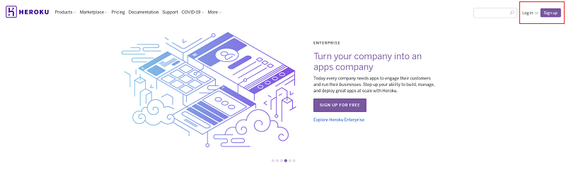
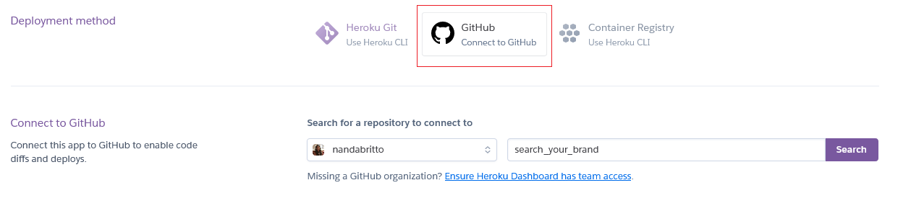
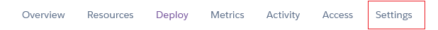

<h1 align=center> Best beer</h1>

Are you a beer lover?  Would you like to know what people are saying about a beer that you are eager to buy?  
 Would you like to have your review list of all beers that you already tasted in your life?  This app is for you!  
On beer rating, you can add a review about your favourite beers or research about beers that you are curious to taste!!  
Check it out!  
Cheers! 

  

Live app link [here](https://bestbeer-app.herokuapp.com)

## User Experience

### User Stories

1. As a user, I would like to be able to …

    1.1 Register on the website using my username, email and password;
    
    1.2. Check all beer reviews added on the website;
    
    1.3 Check beer review details about all added beers.
    
    1.4 Search for a beer or beer style on the navbar.  

2. As a logged user, I would like to be able to …

    2.1 Create a beer review of my favourite beers including :
    + Beer Name,
    + Beer Style,
    + My thoughts about the beer,
    + Beer bitterness level,
    + Beer money and value ratio, and
    + Overall beer rating;

    2.2 Create a new beer or beer style if my beer or beer style is not added to the Database;

    2.3 Check my beer review after added;

    2.4 Edit or delete my beer reviews. 

### 1. Strategy

  + **Project Goal**

   Create a platform that allows people (users) to evaluate beer and share their thoughts in beer reviews. 

### 2. Scope

 * A simple, straightforward intuitive UX experience;
 * A clear content; 
 * An easy navigation for the user through all the features;
 * A site that is visually appealing on most devices.

## Functional Scope 

**Best Beer Flowchart**

**Best Beer DER - Diagram Entity Relationship**

**Agile Methodology**

All functionality and development of this project will be managed using Jira (https://bestbeer.atlassian.net)

*Credentials to this management tool will be provided during submission.

All sprits are described here.

* Sprint 1

* Sprint 2

* Sprint 3

* Sprint 4

* Sprint 5

* Sprint 6

* Sprint 7

### 3. Structure

* A clear and simple layout is in place to ensure users can navigate intuitively and have an easy experience.
* Navbar is fixed on top to facilitate users to navigate through pages easily. Small navigation is the same on all pages to ensure easy navigation.
* Add, Edit and Update Review are straightforward forms to allow the user to use the features without issues.

### 4. Skeleton

Wireframes created with Balsamiq. The project was developed from initial wireframes and some modifications were made during the development process to assure better usability. 

Click to see wireframes:

  

### 5. Surface

* Colours

The Colour scheme was generated using the eyedropper plugin, to get one colour from the logo image, and [coolors](https://coolors.co/) to generate the colour palette.

  

* Font Selection
 
Two complimentary fonts were chosen with [Google Fonts](https://fonts.google.com/) to be used across the whole of the website.

The chosen fonts were Lobster for headings, and navbar and Open Sans for lists, buttons and paragraphs.

  

## Existing Features

### **Navbar** 

+ Fixed Navbar allow the user easy access to all pages. 

1. Login and  Register User buttons are present on the navbar if the user is not logged. 

2. Logout and Rate your beer buttons are present if the user is logged. 

3. Beer reviews and search beer by name and style are present to all users (logged or not).

4. User can search their prefered beer by name or style on the navbar. 

    i. Beer style has a dropdown menu with all styles registered;

    ii. On the Beer name search, the user can add just a few letters to find their prefered beer. 

     

    iii. If there is no review for searched beer or style, the user is informed about it. 

    iv. If any review is found on the Database, the user is redirected to a page with all reviews for that style or beer name. (Details about it on Beer style and Beer reviews page)

5. Collapsed navbar on smaller devices to wrap in all options and assure better navbar design.

  

### **Beer review page**

1. On this page users can access beer reviews available on the website ordered by decreasing the publication date. 

  

2. Each review card contains beer name, style, image, the preview of beer review (full available on beer detail page), bitterness and money-value level, beer rating, author and publication date. 

* The entire card is a link to the beer details page.

### **Beer detail page** 

1. On this page users can access the entire content for a beer review. 

  1.1 If the reviews on this page were made for the user accessing it, two buttons became available:
   

  i. Edit Review (highlighted on green)
  
  ii. Delete Review (highlighted on red)

### **Update Review Page** 

1. On this page a logged user can change a review made by them. All fields are already populated, allowing the user to see which information they would like to change. 
2. The back button redirect the user to the previous page without changes on review. 

### **Delete Review Page** 

1. If users click to delete a review, they will be redirected to a deleted page to confirm the deletion or cancel it. 

### **Beer Style and Beer Categories Pages** 

1. After searcher a beer by its style on the navbar, the user is redirected to this page where they can find all reviews related to the search. 

  1.1 Beer Style search example:

  

  1.2 Beer search example: 

  

2. If no review is available, a message will be in place to inform it and suggest the first review. 

## Future Features

I would like to ...

1. Add an infinite carousel to present beer reviews on the reviews list webpage;
2. Create a placeholder image database to be added on the post if the user doesn't add a beer image on their review;
3. Add a beer style JSON database on Beer style form;
4. Add a beer JSON database on Beer Form; 
5. Include icon rating for bitterness and money value field. 
6. Include Brewery Name on beer review.

## Languages Used

Python 3.0

## Frameworks, Libraries & Programs Used

Balsamiq: Balsamiq was used to create the wireframes during the design process.
Favicon Generator: Used to create favicon used on the website.
Font Awesome: Font Awesome was used on all pages to add icons for aesthetic and UX purposes.
Grammarly: Used to correct any spell mistakes on readme and app text.
Git: Git was used for version control by utilizing the Gitpod terminal to commit to Git and Push to GitHub.
GitHub: GitHub is used to store the project's code after being pushed from Git.
Google Fonts: Google fonts are used to add fonts for aesthetic and UX purposes.
Django: Framework used to add structure to the platform. 
PGAdmin: Used to administer Database and generate DER.

## Testing and Code validation 

All testing and code validation details are described in a separate file called TESTING.md and can be found [here](TESTING.md).

## Project Bugs and Solutions:

| Bugs              | Solutions |
| ---               | --------- |
| Database inconsistency during unittests|Restart all projects adding two different databases (development and production) to make it possible to run tests successfully.
| Update Review Unittest failed when tried to change a review | Debug Update review class models and change save function resolved the problem. 
| Navbar dropdown opening behind site divs | Add z-index to navbar resolved the problem. 
| Register feature was not showing the error when it happened | Debug Register function and remove else statement to redirect the user to the same page when it happens. After deleting this part of the function, everything worked fine. 

## Deployment 

This app is deployed using Heroku.

Heroku Deployment steps 

 
 1. Ensure all dependencies are listed on requirements.txt. 
 
 Write on python terminal ` pip3 freeze > requirements.txt` and a list with all requirements will be created to be read by Heroku. 
 
 2. Setting up your Heroku

    2.1 Go to Heroku website (https://www.heroku.com/). 
    2.2 Login to Heroku and go to Create App.
    
    
    
    
    
    2.3 Click in New and Create a new app
    
    
    
    2.4 Choose a name and set your location
    
    

    2.5. Navigate to the Resources tab 

    

    2.6. Click on Resources and Seach for Heroku Postgres and select it on the list.
    
    
    
    2.7. Navigate to the deploy tab
    
    
    
    2.8. Click in Connect to Github and search for 'nandabritto' GitHub account and 'search_your_brand' repository
    
    
    
    2.9.  Navigate to the settings tab
    
    
    
    2.10.  Click on Config Vars, and add your Cloudinary, Database URL (from Heroku-Postgres) and Secret key.    
    
    
 

3. Deployment on Heroku

    3.1.  Navigate to the Deploy tab.
    
    
    
    3.2.  Choose the main branch to deploy and enable automatic deployment to build Heroku every time any changes are pushed on the repository.
    
    
    
    3.3 Click on manual deploy to build the app.  When complete, click on View to redirect to the live site. 
    
    

Forking the GitHub Repository 

* By forking the GitHub Repository you will be able to make a copy of the original repository on your own GitHub account allowing you to view and/or make changes without affecting the original repository by using the following steps:

    Log in to GitHub and locate the GitHub Repository
    At the top of the Repository (not top of page) just above the "Settings" button on the menu, locate the "Fork" button.
    You should now have a copy of the original repository in your GitHub account.

* Making a Local Clone

    Log in to GitHub and locate the GitHub Repository
    Under the repository name, click "Clone or download".
    To clone the repository using HTTPS, under "Clone with HTTPS", copy the link.
    Open Git Bash
    Change the current working directory to the location where you want the cloned directory to be made.
    Type git clone, and then paste the URL you copied in Step 3.

$ git clone https://github.com/nandabritto/Bestbeer

Press Enter. Your local clone will be created.

# Credits

## Media

+ All pictures and images used in this project are from [Depositphotos](https://depositphotos.com).

## Work based on other code

[Codemy](https://www.youtube.com/channel/UCFB0dxMudkws1q8w5NJEAmw) - Used as a base to develop several features like login, registration and beer review form.  
[Pyplane](https://www.youtube.com/channel/UCQtHyVB4O4Nwy1ff5qQnyRw) - Star rating tutorial used to develop beer ratin feature.  
[Tutorials Point](https://www.tutorialspoint.com/django-handling-multiple-forms-in-single-view) - Used to add different  django forms on same add review page.  

# Acknowledgements

+ Stack Overflow is a valuable resource for solving lots of issues.
+ W3schools and Django documentation for general reference.

I would also like to thank:

+ My husband Guilherme for all the support on stressful moments, helping to figure out lots of bugs and for reviewing everything.
+ Code institute tutors, for help with several issues and bugs.

