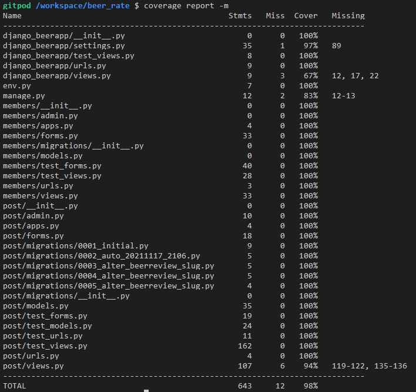

# Testing

During code development of each function tests were in place to be sure that it was running as expected. The following sections describe all tests are done and error handling in place.

## Code Validation Testing

## Automated tests
========================================================================================
### **Members App** 

All functions on the members' app were tested using unit tests. 

  * Views 

  * Forms 

  * Members Unittests Overall

========================================================================================
### **Post App** 

  * Views 

  * Forms 

 * Urls 

 * Models

  * Post Unittests Overall

### **Overal Test on plataform** 

At the end of the development of this project (phase 1 - before submission day), coverage tools were used to assert that all functions were covered by automated tests. 

+ **post/views.py**

    The lines uncovered by unit tests on post/views.py refer to the update view function. This was described in the bugs section in the readme.md. As this automated test was not done, manual tests were conducted to be sure that features were working as expected and without errors. 

+ **django_beerapp/settings.py**

    These uncovered lines refer to databased used (f production or development) and it was tested manually as well. 

## Integration Test Case

+ On this project the Incremental Testing method was used.

 Integrated units were checked after the developer finished writing code for every new feature. This approach was used to find defects early and because was easy to find the cause of the defect thanks to a step-by-step examination. 

+ The integration tests were divided by features/pages and its described below: 

### **Navbar**

| Test Case Id | Description | Expect result|
|:----:|:----:|:----:|
| 1 | Click Beer Reviews' navbar button| To be directed to the Beer Reviews Page|
| 2 | Click login's navbar button | To be directed to the Login Page|
| 3 | Click Beer Styles' navbar dropdown button| To be presented with a list of castrated beer styles on platform|
| 4 | Click in one of Beer Styles' options on the dropdown menu| To be directed to the beer style category page with a piece of information about my search|
| 5 | Add a beer name (present on DB) on left field and click search | To be directed to the beer category page with a piece of information about my search|
| 5 | Add a beer name (not present on DB) on left field and click search | To be directed to the beer category page with information about the unexistence of records about this beer|
| 6 | A logged User click logout's navbar button | To be logged out and directed to the Home Page|

### **Footer** 

| Test Case Id | Description | Expect result|
|:----:|:----:|:----:|
| 1 | Click on the LinkedIn button| To be directed to the developer's LinkedIn page. |
| 2 | Click on the Github button | To be directed to the developer's GitHub page.|

### **Login**

| Test Case Id | Description | Expect result|
|:----:|:----:|:----:|
| 1 | Enter login credentials and click on the Login button| To be directed to the home page|
| 2 | Enter invalid login credentials and click on the Login button| To be presented to an error message for each invalid field|

### **Register**

| Test Case Id | Description | Expect result|
|:----:|:----:|:----:|
| 1 | Enter all register data and click on the Sign In button| To be directed to the home page, presented to a success message and already logged in|
| 2 | Enter invalid register data in any field and click on the Login button| To be presented to an error message|

### **Reviews Card**

| Test Case Id | Description | Expect result|
|:----:|:----:|:----:|
| 1 | Click in a beer review card| To be directed to the beer detail view 
| 2 | Click on Edit button present on card| To be direct to update review page|
| 3 | Click on Delete button present on card| To be direct to confirm deletion page|

### **Buttons**

| Test Case Id | Description | Expect result|
|:----:|:----:|:----:|
| 1 | Click Next pagination button| To be direct to the next review page|
| 2 | Click Last pagination button| To be direct to the last review page|
| 3 | Click First pagination button| To be direct to the first review page|
| 4 | Click Previous pagination button| To be direct to the previous review page|
| 5 | Click Go Back button on update review page| To be direct to the previous navigated page|
| 5 | Click Back to Reviews button on detail review page| To be direct to the beer reviews navigated page|
| 6 | Click Update button on update review page| To be direct to the beer detail navigated page and be presented with new updated review|
| 7 | Click on a star in rating beer or update beer page | Populate beer rating field on review form|
| 8 | Click on beer style dropdown button on add beer rate or update beer page | Be presented with all castrated beer styles on DB|
| 9 | Click on beer dropdown button on add beer rate or update beer page | Be presented with all castrated beers on DB|
| 10 | Click on bitterness dropdown button on add beer rate or update beer page | Be presented with all bitterness choices (1-5)|
| 11 | Click on the money-value dropdown button on add beer rate or update beer page | Be presented with all money-value choices (1-5)|
| 12 | Click on browse image button on add beer rate or update beer page | Open your directory to find an image to upload|
| 13 | Check clear on update beer page | Clear image previously uploaded to beer review|
| 14 | Click Review Your Beer Now on beer or beer style categories page| To be direct to the add beer review page|
| 15 | Click Login and Review on beer or beer style categories page| To be direct to the login page|

## Python (PEP8) Validation

###  **Members App** 

        
        
        
        
        
        

### **Post App** 

        
        
        
        
        
        
        
        
        

        
## CSS Code Validation

        

## JavaScript Code Validation

### **add_review.js** 

+ On first round of checks, all functions were mmissing semicolon at the end. 

   

+ The missing semicolons were placed and all issues have been solved. 

   

### **script.js** 

   

### **toollip.js** 

   

## Exploratory Testing
========================================================================================

### Initial User Testing (Alpha)

A session was held with an end-user. The feedback obtained is listed below:

1. **Navbar**

   1.1 The page which we are is slightly highlighted, I would like a more visual appealing colour to better differentiate which page I am on.

   1.2 "Beer Styles" dropdown menu is mixed with operational menu options. I would like to have on Left: "Best Beer" (as home), "Beer Reviews", "Beer Styles" and "Search your beer". On Right, "Register", "Login", "Logout".

2. **Home Page**

   2.1 I would like to have the option to log in directly from there, without needing to go to the login page, and then log in.

3. **Register User Page**

   3.1 When entered a password that do not match, a very quick message appeared on top, but it was not possible to read in time. I would like this message to stick to the bottom of the "Register" container so users can read and understand the error.

   3.2 When logged successful, I have been redirected to the home page, the page which I just came from. I would like to be redirected to the reviews page, where I can use the information on the website.

4. **Beer Reviews page**

   4.1 I would like to have the option to search, filter and choose different sort options (like Money-Value) directly on-page, without needing to go through the top bar

   4.2 - The "Beer reviews" title looks blended with the background image, I would like to use a larger box with different text sizes or even some logo images. These "Beer reviews" there may also not be required if the top bar use a more distinct colour when the page is the one selected.

   4.3 Buttons "First Next Last" looks too close to the card box and background colour blend then. I would like a better visual to differentiate between they are buttons and not random text on the foot of the page.

   4.4 The page should inform default sort order, like displaying "Latest beer reviews" instead of just "Beer reviews" and sort that page by review date.

5. **Review Detail Page**

   5.1 At bottom of the review container, where we see "Written by:", I would rather have it as "Review by: <name of author>"  and on the same row "Created at <date>"

### **Response to the user experience test:**
  All user feedback was incorporated on the platform except by points 2.1 and 4.1 that is planned to be implemented as future features. 

## Manual Testing
========================================================================================
### Desktop

  Mozilla Firefox, Google Chrome, Microsoft Edge: everything is working good. Page loads, all features are working and no problems were found in adding, updating, deleting or simply seeing the content. 

### Mobile

  Tested with Xiaomi Mi6 and Xiaomi Mi8 and the platform works well and without any issues. 

### WAVE Accessibility validation

**Home page WAVE analysis**
    

    

**Beer Reviews WAVE analysis**

    

**Add review Page WAVE analysis**

  

    

**Update review Page WAVE analysis**

  

    

**Beer Style Search Page WAVE analysis**

  

    

**Beer Style Search Page (No reviews) WAVE analysis**

  

    

**Beer Search Page WAVE analysis**

  

    

**Beer Search Page (No reviews) WAVE analysis**

  

    

